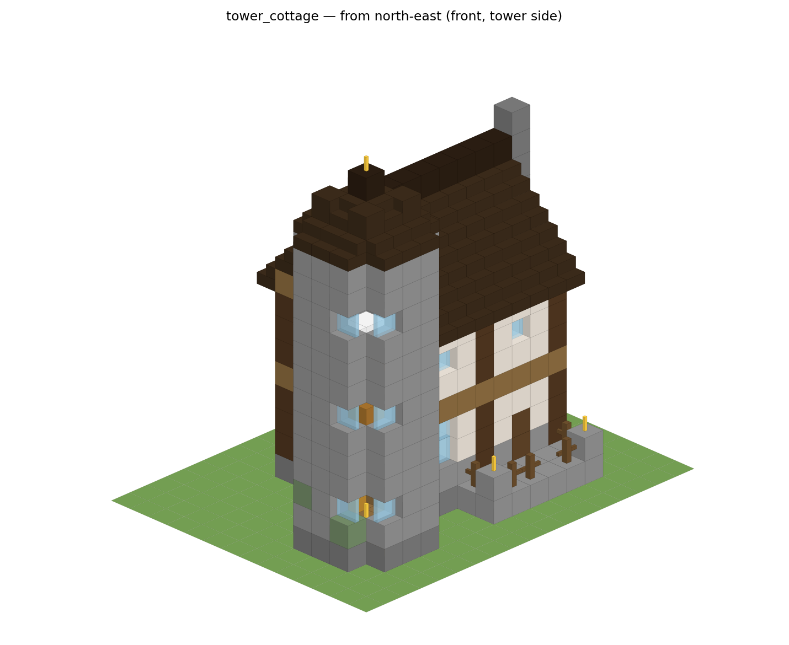
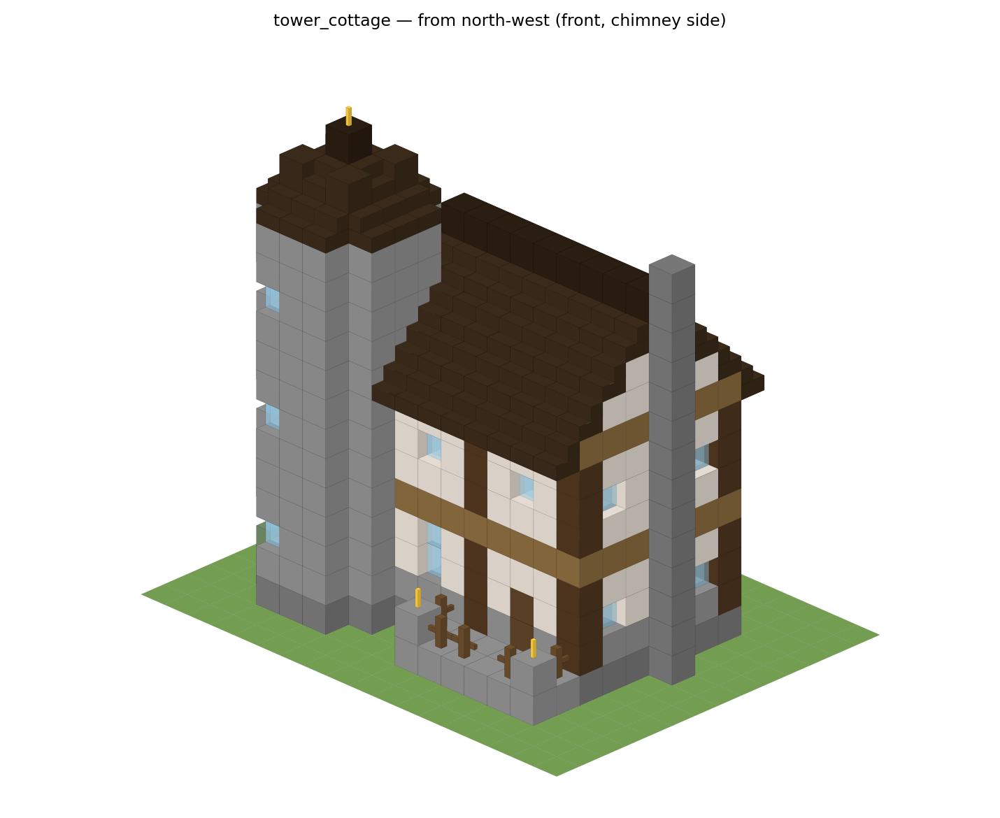
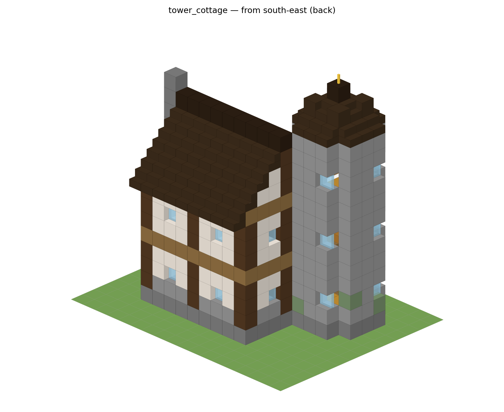
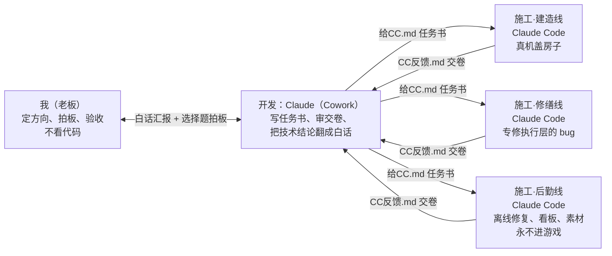

# MC Agent：《我的世界》里会自己干活的 AI 伙伴

一个在 Minecraft 里像真人玩家一样行动的 AI 伙伴：听得懂中文指令，会跟随、打怪、挖矿、种地、烧东西、存箱子，还能**自己备料、自己选地、照着图纸把房子盖起来**。被困了会自救，死了能回去接着干。

这个项目更想展示的是**它是怎么被做出来的**：发起人是物流工程专业的本科生，不是计算机专业。代码由 AI 编写，我负责定方向、拍板和验收。开发过程被组织成一个小型「AI 团队」：一个 AI 当技术负责人，三个 AI 施工员分三条线并行开工，彼此靠固定文件交接，每个决定都记账。

> 状态：**开发中**。下面的「现在做到哪」写的是真实进度，包括没做成的部分。

---

## 演示

<!-- TODO：把录屏放这里（GIF 或 B 站链接） -->
- 小木屋同一张图纸连盖三次：_（录屏待补）_
- 「塔楼小筑」施工过程：_（录屏待补）_
- 聊天下指令：_（截图待补）_

---

## 它能做什么

| 你在游戏里说 | 它会 |
|---|---|
| 「跟着我」「过来」 | 找路跟上你，会绕坑、会开门、卡住会自己脱困 |
| 「守着我」「打怪」 | 护卫、迎战附近的怪 |
| 「去挖铁矿」 | 找矿、挖、把掉落物捡回来 |
| 「建个农田」、种地类指令 | 开垦、播种、收割 |
| 「烧铁」「把东西存起来」 | 用熔炉熔炼，把东西放进箱子 |
| 「建个小屋」「建个塔楼小筑」 | 读图纸 → 算材料 → 缺什么去备 → 挑平地 → 按顺序施工；中途被打断能从断点续建 |
| 「你现在在干嘛」 | 报告当前任务和进度 |
| （不用说） | 饿了吃饭、天黑睡觉、掉坑里自救、死亡后回到工地继续 |

另外有两项可选功能：接入 DeepSeek 大模型闲聊，接入火山引擎语音做语音合成和按键说话。默认人设是中性的「安迪」，`personas/` 里还有几个性格不同的人设，在 `.env` 里改 `PERSONA` 就能换。

---

## 现在做到哪（截至 2026-09-17）

| 目标 | 规模 | 结果 |
|---|---|---|
| 小木屋（程序生成） | 约 180 块 | ✅ 同一张图纸在平地上**连盖 3 次全部成功**，记为「稳定」 |
| 现代别墅（社区图纸） | 4431 块 | ✅ 完工一次，和图纸的吻合度 99.98%；作为长跑用例保留，不重复盖 |
| 城墙门楼（社区图纸） | 1233 块 | ⏸ 卡在一格宽的城垛顶上找不到能站的位置，已封存 |
| 「塔楼小筑」（AI 设计的图纸） | 715 块 | 🔧 三栋都能一句话开工，不搭脚手架也能把最高处的方块放上去；但 **3 栋都还没完工**（分别盖到 707、714、586 块），卡在「床的朝向放错」和「楼梯井多出一块木板」，正在修 |

稳定的标准定得很死：**同一张图纸连续 3 次干净完工**才算稳。中途冒出新的毛病，计数就清零。

「塔楼小筑」的设计渲染图（两层都铎风主屋 + 三层石砖塔楼 + 门廊 + 烟囱，图纸在 `blueprints/tower_cottage.json`）：

<p align="center">  </p>

---

## 这个项目是怎么做出来的

### 分工



- **三条线互不干扰**：各用各的代码副本（git worktree）、各开各的游戏服务器和地图，最后统一合并回主干。
- **不靠聊天传话**：任务书写在 `给CC.md`，结果写在 `CC反馈.md`，旧的归档进 `docs/协作/历史/`。一共 60 多轮，每一轮都有记录。
- **每个决定都记账**：[`docs/协作/老板决策台账.md`](docs/协作/老板决策台账.md) 只追加不改写，目前记到第 117 号。
- **交卷要分清确定程度**：每条结论都要标「已证实 / 合理推断 / 不确定」，不许把猜测写成事实。
- **按难度选模型**：任务书里写明这一轮用哪个模型、多大思考强度。机械活用便宜的，根因不明的难题用最强的，原则是「该花就花、能省就省」。
- **真机验收**：修好的东西要在真实游戏服务器里跑给人看。AI 写的「陪玩脚本」以玩家身份进服，下指令、盯进度、记证据。

### 走过的弯路（也是真实记录）

- 一开始想让它盖 4000 多块的大别墅，结果换一张图纸、重跑一次都会出新问题。后来把目标换成「中等民居连盖三次」，先把执行层做稳。
- 想找一张 600–850 块的中等民居图纸，社区图纸普查了 18 份没有一份合适，新接的来源还是假素材，最后由 AI 自己设计了「塔楼小筑」。
- 试过做网页直播观战，因为卡、镜头动不了，整套删掉，改成用真客户端旁观。

### 数字

- 代码约 7.7 万行（JavaScript，不含测试），自动化测试约 4.4 万行（70 个测试文件）
- 2026 年 5 月底开工。早期用 Codex 开发，8 月底起改成上面这套 Claude 协作方式

---

## 目录

```text
bot.js              入口：连服务器、接聊天、调度
ai/                 听懂指令（意图解析、指令路由、大模型客户端）
tasks/              任务：跟随、挖矿、建造、睡觉、脱困……
actions/            具体动作：走、挖、放方块、开箱子
systems/            各子系统：建造、存储、生存、探索、任务仲裁……
core/               动作锁、心跳循环、断线重连、死亡处理
blueprints/         图纸（含 AI 设计的 tower_cottage.json）
tests/              自动化测试
acceptance/         真机验收框架
dashboard/          本地进度看板
docs/协作/          AI 团队的任务书、交卷记录、决策台账
```

---

## 自己跑起来

需要：Node.js（建议 20 以上）、一台跑在本机的 Minecraft Java 版 1.21.8 服务器（`online-mode=false`）。

```bash
npm install
cp .env.example .env      # 按注释填，至少填 MC_PORT、MC_VERSION、MC_OWNER（你的游戏名）
node bot.js
```

进游戏后在聊天栏说「跟着我」试试。它只听 `MC_OWNER` 这个玩家的话。常用指令走本地规则解析，不依赖大模型；闲聊和听不懂的话才交给 DeepSeek，语音功能需要火山引擎的密钥。

跑测试：

```bash
npm test
```

---

## 致谢与声明

- 基于 [mineflayer](https://github.com/PrismarineJS/mineflayer) 和 [mineflayer-pathfinder](https://github.com/PrismarineJS/mineflayer-pathfinder)
- 语音端点检测用了 [Silero VAD](https://github.com/snakers4/silero-vad) 模型
- 第三方社区图纸没有随仓库发布；`data/community-builds/sources.json` 里只保留来源链接
- 本项目是个人学习作品，与 Mojang、Microsoft 无关

许可证：MIT
